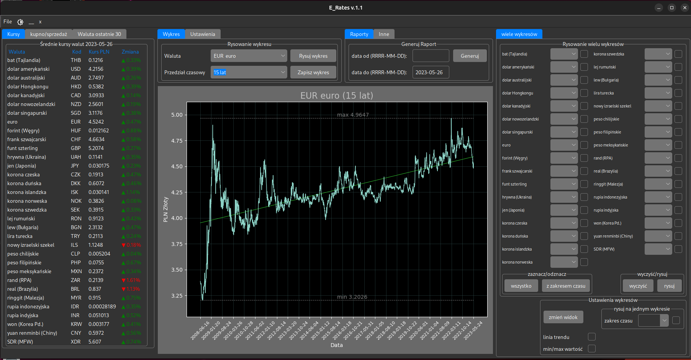
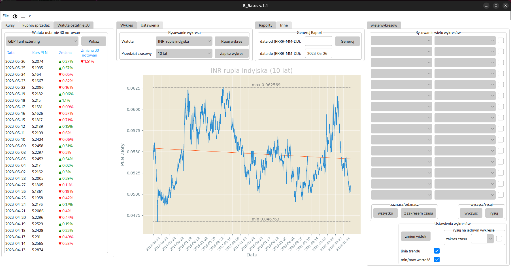
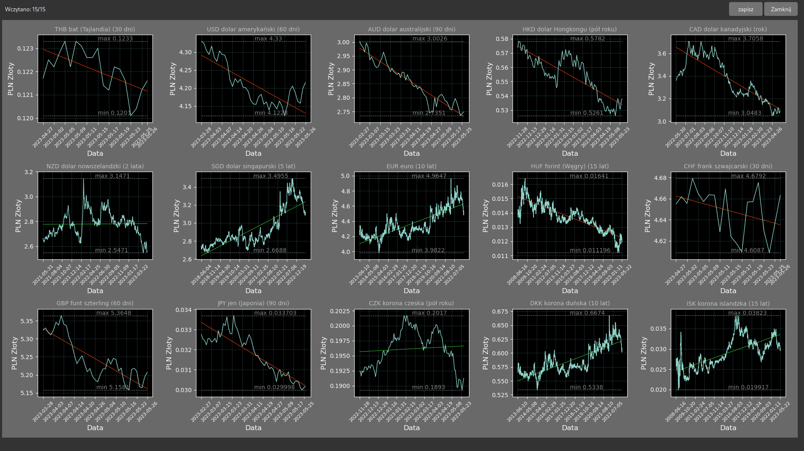
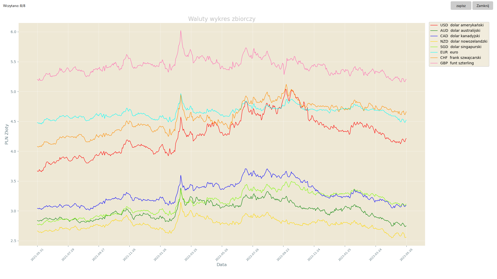

# E_Rates
Current NBP exchange rates - visualizations, historical reports

## Table of Contents
* [General Info](#general-information)
* [Technologies Used](#technologies-used)
* [Features](#features)
* [Screenshots](#screenshots)
* [Setup](#setup)
* [Theme](#theme)
* [Contact](#contact)
* [License](#license)

## General Information
- The application is used to download/visualize current and historical exchange rates from a given time period published by the National Bank of Poland (NBP). It uses the bank's API (api.nbp.pl).
- The aim of the project was to expand the knowledge and consolidate the author's skills in programming in Python and to use in practice knowledge of SQL and Postgresql databases.

## Technologies Used
- python 3.11.2
- PostgreSQL 15.2
- Tkinter 8.6
- Matplotlib 3.5.2

## Features
- Works on operating systems: Linux, Windows
- Three working modes:
  - online - all necessary data are downloaded from NBP servers (database is not required)
  - online with a database - after starting, it creates/updates the database. All data later is retrieved from this current database.
  - offline - runs without internet connection. All data is taken from the database.
- Available in two themes: dark and light
- Current tables: average exchange rates, bid/ask exchange rates, Last 30 exchange rate quotes
- Generating charts of exchange rates in relation to PLN in various display configurations:
  - 1 currency rate chart in the main window
  - from 1 to 15 currency charts in different/same time periods in one full-screen window
  - from 1 to all published exchange rates on one chart in a fullscreen window
  - with a trend line,
  - with min/max value
  - each generated graph can be saved in .png format in default directory "Reports"
  - available time periods: 30 days, 60 days, 90 days, half a year, one year, 2 years, 5 years, 10 years, 15 years
  - available two views to generate multiple charts
- Generating reports in a given time period (start date, end date):
  - in .txt format with full tables for each day
  - in .csv format (ready to be imported into a spreadsheet)
  - each generated report is saved in the default directory "Reports"  

## Screenshots

## Setup
- To run the script in the mode of work without a database, it is enough to copy the repository files to the computer with the python interpreter installed. Custom libraries used in the script and required to run: tkinter, gc, PIL, psycopg2, functools, pandas, numpy, tabulate.
- To run the script in database mode, PostgreSQL must be installed and the server configured. For more information, please visit https://www.postgresql.org/download/

## Theme
The beautiful theme created by rdbdnde 'Azure theme for ttk' is responsible for the appearance of the program
https://github.com/rdbende/Azure-ttk-theme

## Contact
Created by Michał Grabarz grabarzmichal@gmail.com

## License 
This project is open source and available under the [MIT License](./License.txt)
